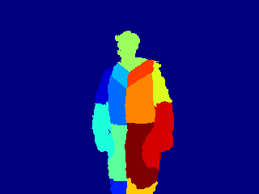
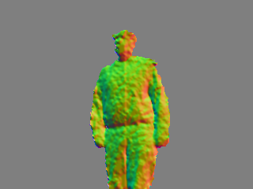

# Example scripts

This directory contains example scripts for processing the logs generated by
this utility.

## labelbones.py

This script labels each point corresponding to a user with an id corresponding
to the nearest bone in the tracked skeleton. In this way we get something like
original body-part labelled images.

## normalshade.py

This script computes pseudo-3d normals for each pixel identified as a user and
outputs an image where the red, green and blue channels reflect the x, y and z
co-ordinates of the normals. The depth image is blurred with a Gaussian filter
beforehand to give smoothed output.
